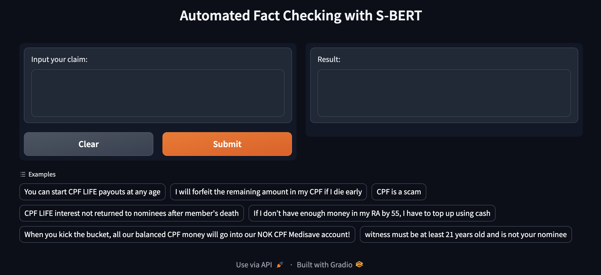

## Demo on building an automated fact checking tool using S-BERT
In this demo, we illustrate the possibility of using Semantic Search + Recognising Textual Entailment (RTE) with Gradio to build an automated fact checking tool. 
The automated fact checking tool takes in a sentence or claim and checks it against a corpus of knowledge to determine if it is true or false.

*_Knowledge base for this demo is based on a small sample of Singapore's CPF-related FAQs (mainly focusing on retirements, accounts, and nominations-related information)_*

---

The automated fact checking process as below:
1. User inputs a sentence (claim)
2. The tool performs semantic search to find the closest match FAQ among the corpus of knowledge
3. After identifying the most similar FAQ, the tool performs another round of semantic search to find the closest match sentence within the FAQ identifed in step 2
4. Finally, Recognising Textual Entailment (RTE) or also known as Natural Language Inference (NLI) is performed on the input sentence (claim) from step 1 and closest matched sentence obtained in step 3 to predict if the claim is true or not  

An example below:

---

## Getting started
Open `Automated Fact Checking Demo.ipynb` on a jupyter notebook environment. Alternatively, you can view the codes in . The notebook consists of further technical details.
